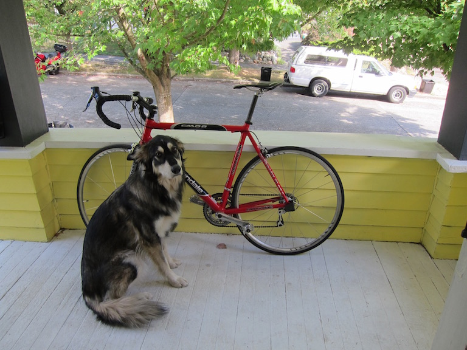
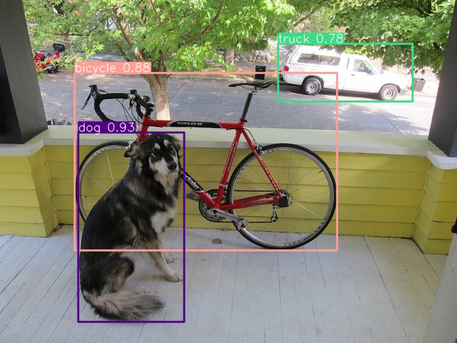
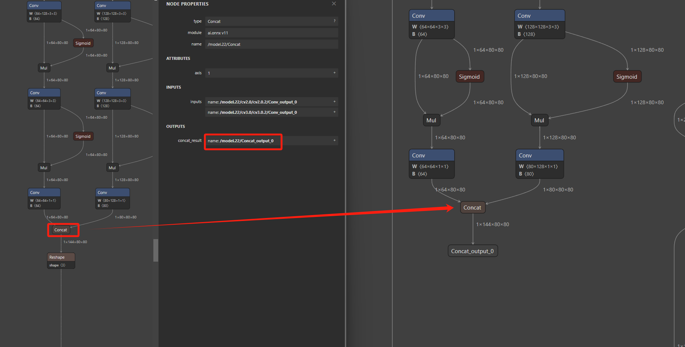
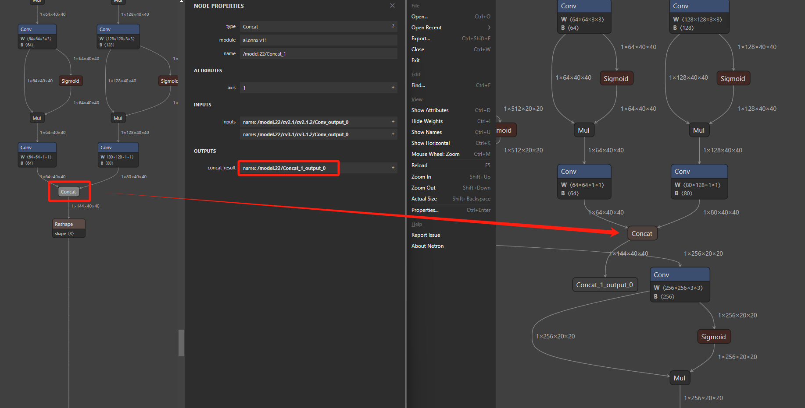
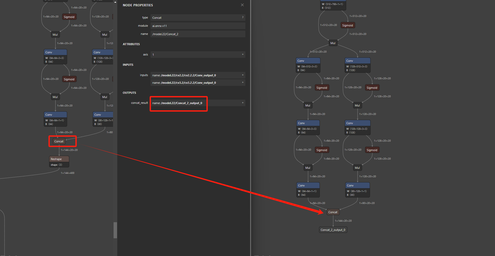
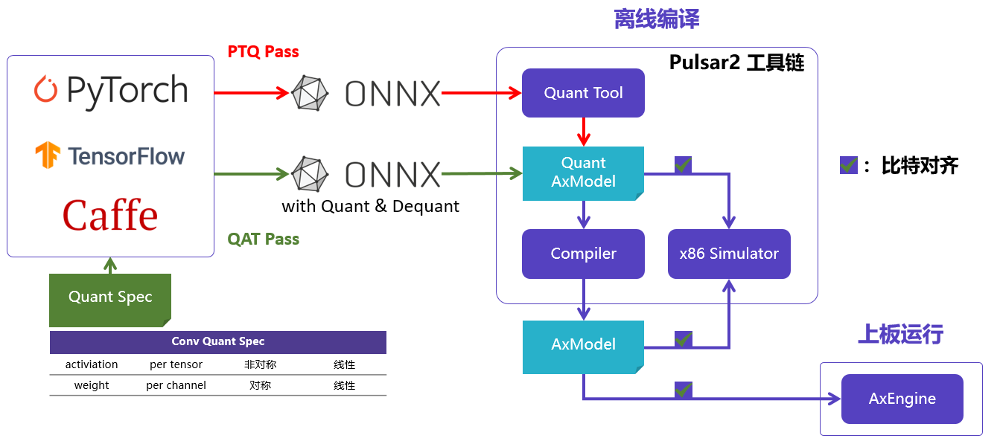
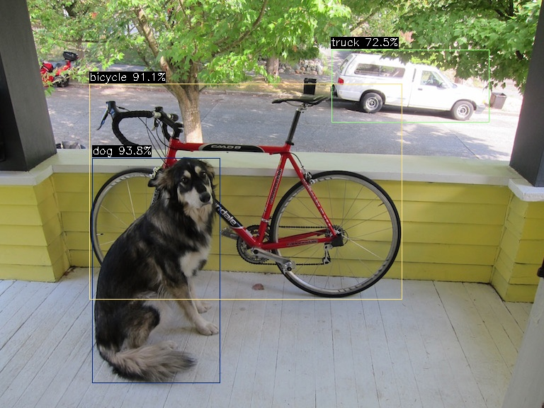

# Algorithm deployment tutorial

This chapter will show you:

- How to export [YOLOv8](https://github.com/ultralytics/ultralytics/blob/main/docs/en/models/yolov8.md)’s ONNX model;
- Obtain the optimized calculation graph through the tools provided by ONNX;
- Generate AX620Q adapted NPU model through Pulsar2 tool chain quantization & compilation;
- Integrate the GitHub open source project [ax_samples](https://github.com/AXERA-TECH/ax-samples) into [YOLOv8](https://github.com/AXERA-TECH/ax-samples/tree/main/examples/ax620e#YOLOv8) runs on the community development board Aixinpai Zero.

## YOLOv8

**YOLOv8** (**Y**ou **O**nly **L**ook **O**nce **v**ersion **8**) was developed by Ultralytics in January 2023 The next major update version of YOLOv5, which will be open sourced on May 10th. YOLOv8 continues to use the design concept of the YOLO series models, which is to quickly and accurately identify objects in images through one forward propagation (You Only Look Once). This version makes several improvements based on YOLOv5 to improve performance and flexibility, making it suitable for a variety of vision tasks such as image classification, object detection, and instance segmentation.

## ONNX model acquisition

### Environment preparation

By default, the necessary python environment for ultralytics repo has been built based on miniconda. At the same time, be prepared to export the necessary third-party dependencies of the ONNX model.

```
pip install onnx
pip install onnxruntime
pip install onnxsim
```

Complete ultralytics project installation

```
pip install ultralytics
```

### Export ONNX

The following python script is used to **download, run, and export** the ONNX model of YOLOv8s

```
from ultralytics import YOLO

# Load a model
model = YOLO("yolov8s.pt")
model.info()

# Use the model
results = model("/home/qtang/images/ssd_dog.jpg")

# Save the results
results[0].save("yolov8s-result.jpg")

# Export to onnx with simplify
model.export(format='onnx', simplify=True)
```

The execution process is as follows

```
(ultralytics) qtang@gpux2:~/ultralytics$ python yolov8-test.py
YOLOv8s summary: 225 layers, 11166560 parameters, 0 gradients, 28.8 GFLOPs

image 1/1 /home/qtang/images/ssd_dog.jpg: 480x640 1 bicycle, 1 truck, 1 dog, 81.8ms
Speed: 4.6ms preprocess, 81.8ms inference, 336.5ms postprocess per image at shape (1, 3, 480, 640)
Ultralytics YOLOv8.1.15 🚀 Python-3.9.18 torch-2.2.0+cu121 CPU (AMD Ryzen Threadripper 3970X 32-Core Processor)

PyTorch: starting from 'yolov8s.pt' with input shape (1, 3, 640, 640) BCHW and output shape(s) (1, 84, 8400) (21.5 MB)

ONNX: starting export with onnx 1.15.0 opset 17...
ONNX: simplifying with onnxsim 0.4.35...
ONNX: export success ✅ 1.6s, saved as 'yolov8s.onnx' (42.7 MB)

Export complete (3.7s)
Results saved to /home/qtang/ultralytics
Predict: yolo predict task=detect model=yolov8s.onnx imgsz=640
Validate: yolo val task=detect model=yolov8s.onnx imgsz=640 data=coco.yaml
Visualize: https://netron.app
(ultralytics) (npu-dev-env) qtang@gpux2:~/ultralytics$
```

Enter image



After the execution is completed, the yolov8s.onnx model and the inference calculation results using the test image ssd_dog.jpg will be obtained.



## Model conversion

### ONNX model optimization

Before using the pulsar2 tool chain for conversion, perform necessary calculation graph optimization on the yolov8s.onnx model obtained in the previous step to improve model deployment efficiency.

```
import onnx

input_path = "yolov8s.onnx"
output_path = "yolov8s-cut.onnx"
input_names = ["images"]
output_names = ["/model.22/Concat_output_0", "/model.22/Concat_1_output_0", "/model.22/Concat_2_output_0"]

onnx.utils.extract_model(input_path, output_path, input_names, output_names)
```

Model differences after cutting







### Pulsar2 compilation

[Pulsar2](https://pulsar2-docs.readthedocs.io/zh-cn/latest/index.html) is a new generation of AI tool chain, including model conversion, offline quantification, model compilation, and heterogeneous scheduling four-in-one super Strong functions further strengthen the need for efficient deployment of network models. While deeply customizing and optimizing the third- and fourth-generation NPU architecture, it also expanded the capabilities and scope of operator & model support, and also has better support for networks with Transformer structures.



Complete graph optimization, offline quantification, compilation, and bisection functions with one click. The whole process takes less than 5 minutes, and the efficiency of model compilation has been improved by orders of magnitude compared with the previous generation tool chain. By default, the Docker-based Pulsar2 tool chain usage environment has been set up.

| File name | Description |
| ------------------- | -------------------------------------- |
| yolov8s_config.json | Configuration files necessary for model conversion |
| yolov8s-cut.onnx | ONNX model to be converted |
| coco_1000.tar | Model conversion PTQ-dependent quantification calibration data set |

The configuration file yolov8s_config.json needs to be modified according to the output node of the model. For example, in the following configuration file, the three tensor_names in output_processors need to be modified to the names of the output nodes of the yolov8s-cut.onnx model that you got based on the article content. , as follows, I fill it as /model.22/Concat_output_0, /model.22/Concat_1_output_0, /model.22/Concat_2_output_0. The function of this step is to add a transpose on the model output node to adapt to the ax-samples Post-processing code, change the shape of the output node from

```
1*144*80*80
1*144*40*40
1*144*20*20
```

Change to

```
1*80*80*144
1*40*40*144
1*20*20*144
```

yolov8s_config.json is as follows

```
{
  "model_type": "ONNX",
  "npu_mode": "NPU1",
  "quant": {
    "input_configs": [
      {
        "tensor_name": "images",
        "calibration_dataset": "./dataset/coco_1000.tar",
        "calibration_size": 32,
        "calibration_mean": [0, 0, 0],
        "calibration_std": [255.0, 255.0, 255.0]
      }
    ],
    "calibration_method": "MSE",
    "precision_analysis": true,
    "precision_analysis_method":"EndToEnd"
  },
  "input_processors": [
    {
      "tensor_name": "images",
      "tensor_format": "BGR",
      "src_format": "BGR",
      "src_dtype": "U8",
      "src_layout": "NHWC"
    }
  ],
  "output_processors": [
    {
      "tensor_name": "/model.22/Concat_output_0",
      "dst_perm": [0, 2, 3, 1]
    },    {
      "tensor_name": "/model.22/Concat_1_output_0",
      "dst_perm": [0, 2, 3, 1]
    },    {
      "tensor_name": "/model.22/Concat_2_output_0",
      "dst_perm": [0, 2, 3, 1]
    }
  ],
  "compiler": {
    "check": 0
  }
}
```

The conversion command is as follows

```
pulsar2 build --input yolov8s-cut.onnx --config yolov8s_config.json --output_dir output --output_name yolov8s.axmodel --target_hardware AX620E
```
After the conversion is completed, the yolov8s.axmodel file will be generated under the ./output path, which is used for final running on the board.

## Example on the board

By default, the Aixinpai Zero development board test environment has been set up, and you can log in to the console through SSH. Running the example on the board depends on the following files:

| File name | Description |
| --------------- | -------------------------------------|
| ax_yolov8 | YOLOv8 DEMO based on AX620Q, NPU computing |
| yolov8s.axmodel | axmodel generated by pulsar2 conversion |
| ssd_dog.jpg | Test picture |

ax_yolov8 Please refer to [ax-samples](https://github.com/AXERA-TECH/ax-samples) project to compile and obtain. The execution results are as follows

```
root@ax620e:/root # ./ax_yolov8 -m yolov8s.axmodel -i ssd_dog.jpg
-----------------------------------------------
model file: yolov8s.axmodel
image file: ssd_dog.jpg
img_h, img_w : 640 640
-----------------------------------------------
Engine creating handle is done.
Engine creating context is done.
Engine get io info is done.
Engine alloc io is done.
Engine push input is done.
-----------------------------------------------
post process cost time:8.57 ms
-----------------------------------------------
Repeat 10 times, avg time 27.13 ms, max_time 27.14 ms, min_time 27.12 ms
-----------------------------------------------
detection number: 3
16: 94%, [130, 223, 311, 541], dog
 1: 91%, [126, 118, 569, 423], bicycle
 7: 73%, [468, 70, 691, 173], truck
-----------------------------------------------
```
After execution is completed, yolov8s_out.jpg will be generated in the current path.



## Conclusion

This chapter will be continuously updated and improved based on user feedback. After all, the most common intelligent algorithm application based on inclusive AI chips such as AX620Q is target detection tasks.

- All relevant documents for this article can be obtained through [Baidu Cloud Disk](https://pan.baidu.com/s/1OKKDtXHOvRT3EyiYh4Sjow?pwd=s2rd)
- The solution for deploying YOLOv8 in this article is also applicable to AX650A, AX650N, and AX630C
- For more AI examples, please refer to our open source project [ax_samples](https://github.com/AXERA-TECH/ax-samples) on Github
