# Instructions for the use board

**AXera_Pi Zero** adds 4G wireless communications board (referred to as: expansion board), supports 4G/WIFI/SD card. 

Using different modes, the antenna installation position is also different. The specific connection position is shown in the figure. 
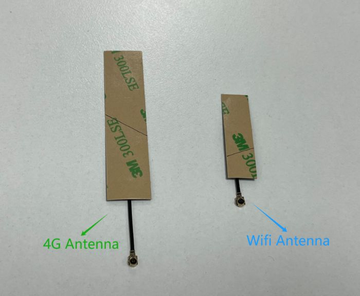

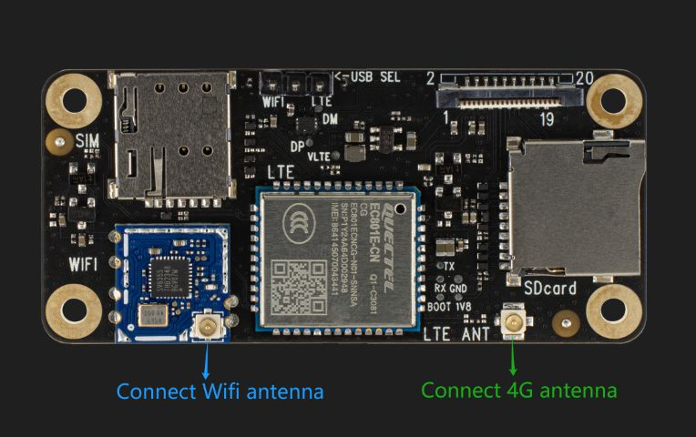

## use SD card

1.After inserting the SD card, enter the terminal to see if there is a SD card partition. 
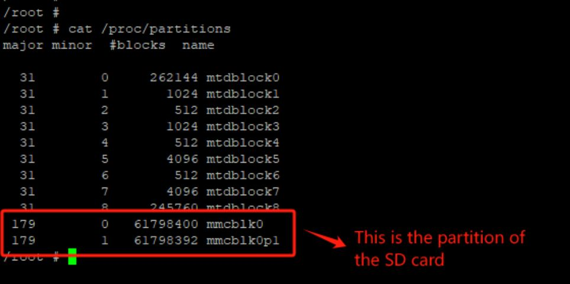

2.Format the SD card. 

3.Create a folder that needs to be placed. 
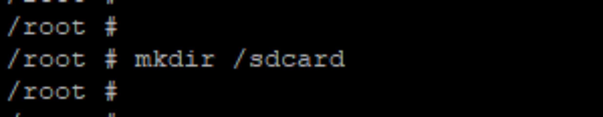

4.Mount SD card to the created folder. 
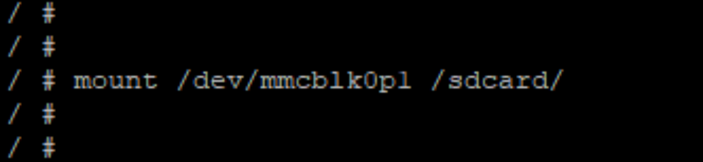

5.Enter the command to see if it is successful. 
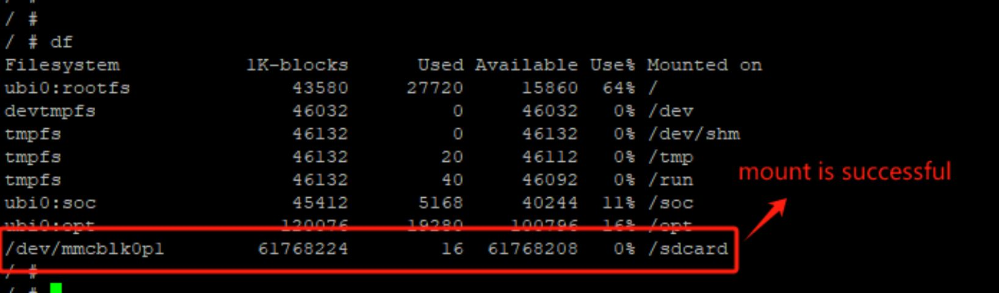

6.If you need to mount it to other positions, first uninstall the original mount position, confirm whether the uninstallation is successful in step 5, and then start the operation from step 1. 

## Switch 4G mode

<b>When switching the 4G/WIFI mode, you need to enter through the network cable/serial line. At this time, the Type-C line is only for power supply function. When the jumper hat is switched, it needs to be performed in the state of power off.</b>

1.Connect to network cables and Type-C cable，<a href="https://axera-pi-zero-docs-cn.readthedocs.io/zh-cn/latest/doc_guide_faq.html">Configuration device IP</a>.

2.Disgle the Type-C line and place the jumper hat of the motherboard on the WIFI side. (When downloading the burning, you need to place the jump cap on the Typec side) 
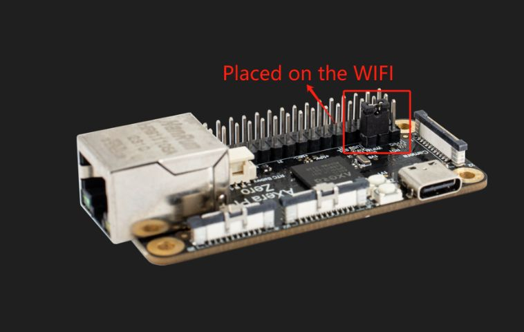

3.Place the jumper hat of the extended board to the LTE end, insert 4G card, and switch to 4G mode. 
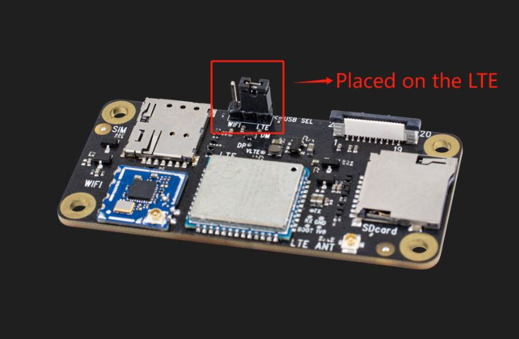

4.Connect the Type-C line, open the Putty, and enter the device terminal through the configured IP. 
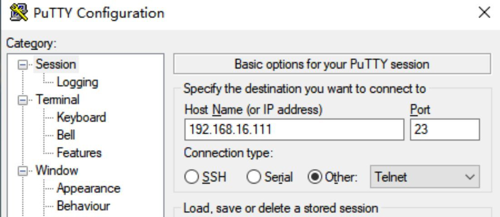

5.Switch to OTG. 
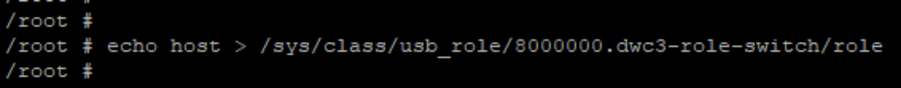

6.Enter the command. If the following pictures are shown, the OTG switch is successful. 
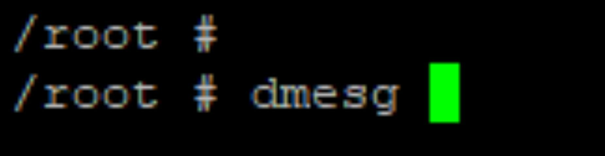

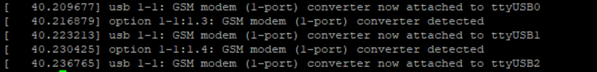

7.Dial with dialing tools (no need to stop, return to the next step). 
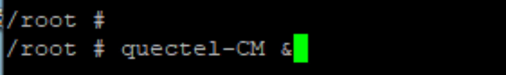

8.Dial with dialing tools (no need to stop, return to the next step). 
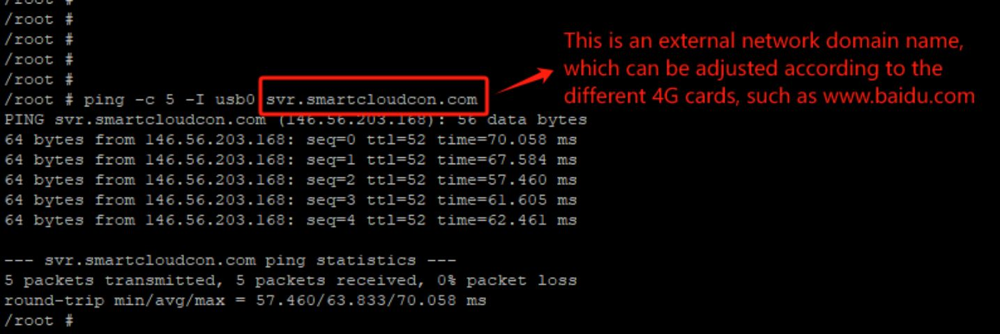

## Switch WiFi mode

1.Same as the first and 2nd points of switching 4G mode. 

2.Switch the jumper hat of the expansion board to the WiFi end and switch to the WIFI mode. 
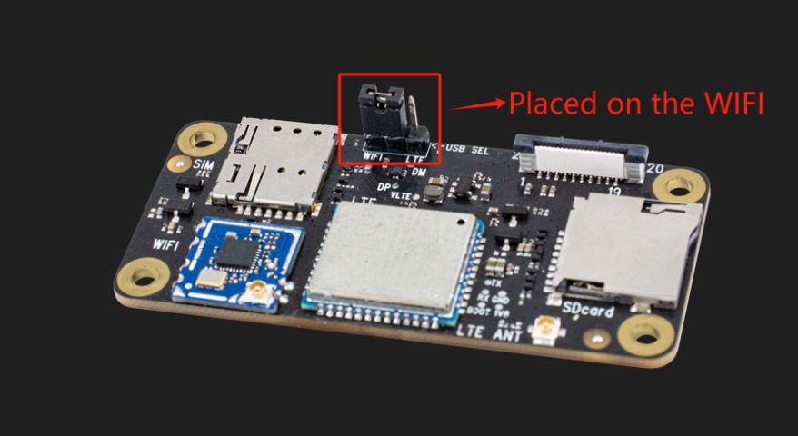

3.Same as the 4th and 5th points of switching 4G mode. 

4.Manually pull up the wifi GPIO port. 
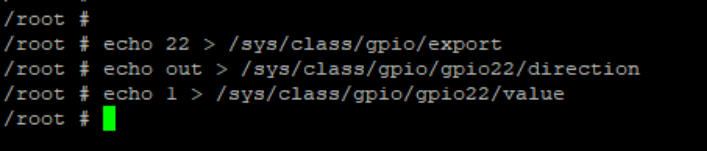

5.Download the WIFI driver and wait for a while. 

6.Enter the command. If the following pictures appear, the WiFi driver download is successful. 

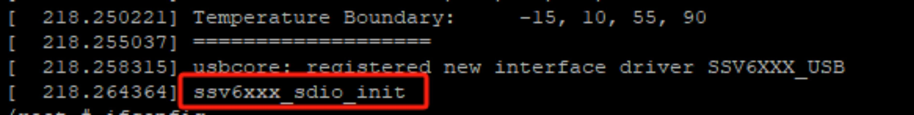

7.Manually pull up the WiFi network interface. 

8.Confirm whether the WIFI network interface is successfully pulled up through the command. 
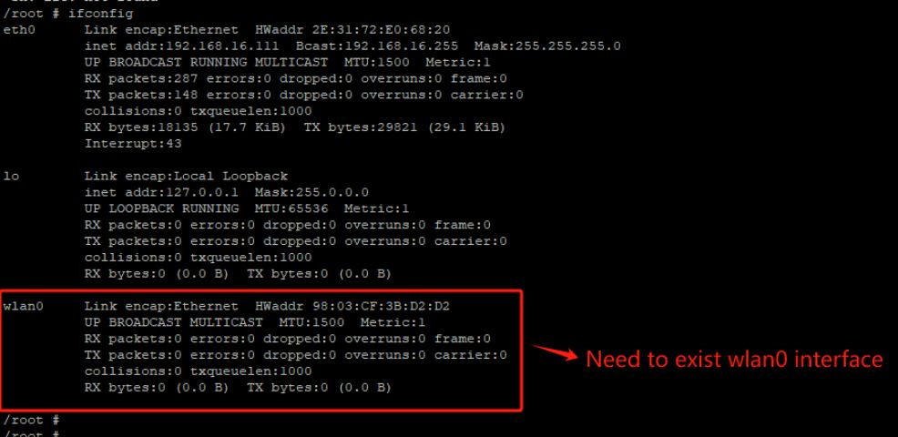

<b>When choosing a WiFi mode, only one of them can be selected, and two modes are not allowed to exist simultaneously.</b>

### WIFI's AP mode

1.Configure the hostapd.conf file of wifi. (WiFi name and password can be configured by yourself). 
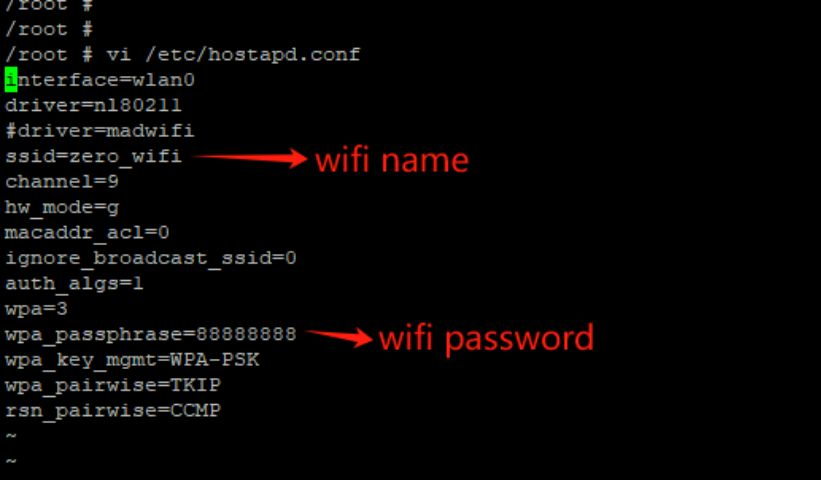

2.Start hostapd. (With this print, it means successful start). 
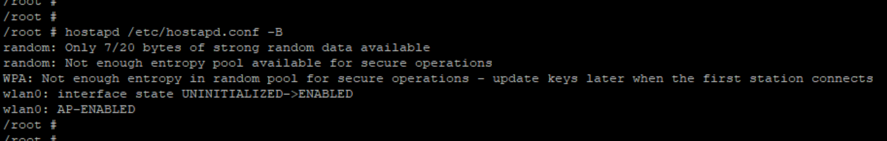

3.Configure the udhcpd.conf file. (The network segment can be configured by itself). 
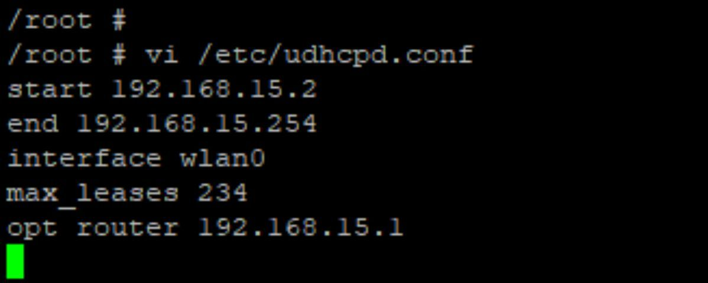 

4.Allocate the IP address for wlan0, the default is the gateway address. 
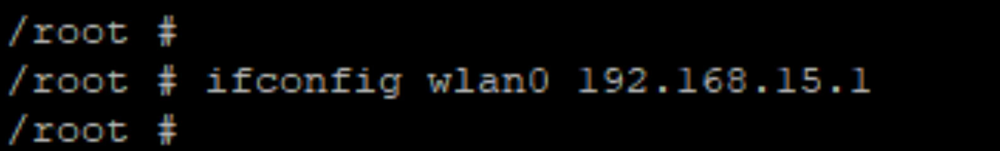

5.Start UDHCPD. 
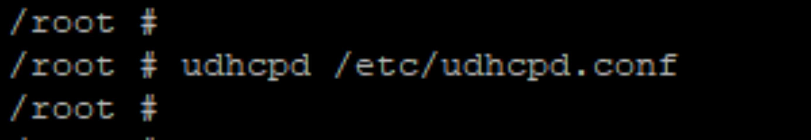

6.The configured WiFi is connected by the mobile phone to verify whether it is successful. 

### WIFI's STA mode

1.Configure the wpa_supplicant.conf file. 
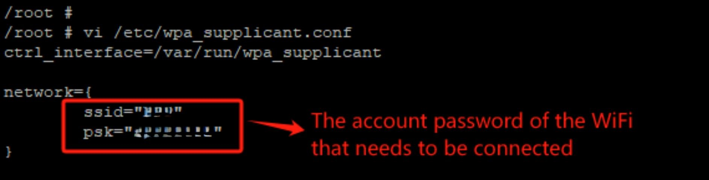

2.Start the wpa_supplicant service in the background. 
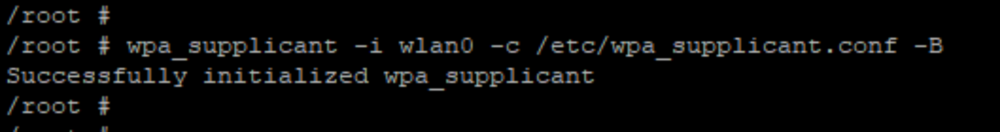

3.Scan and obtain WiFi hotspots around the peripheral, confirm that the WiFi hotspot that needs to be connected is among them. 
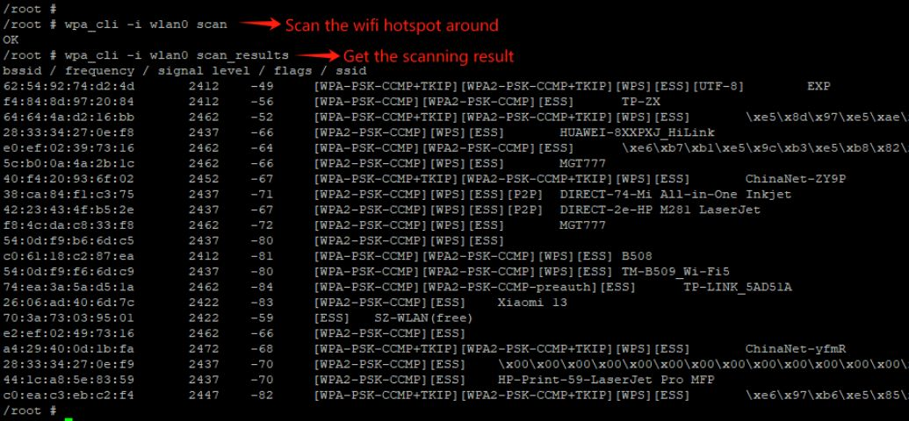

4.Automatically obtain the IP address assigned by WiFi hot spots through commands. 
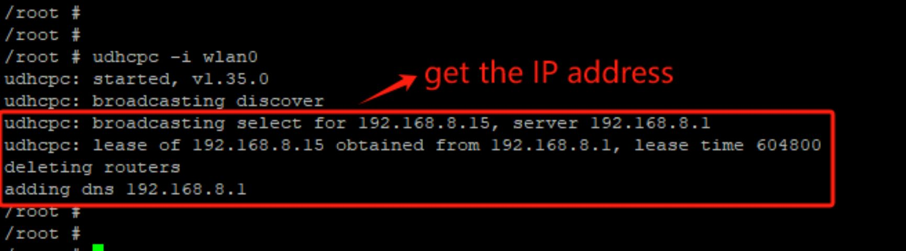

5.Verify whether the device can access the Internet. 
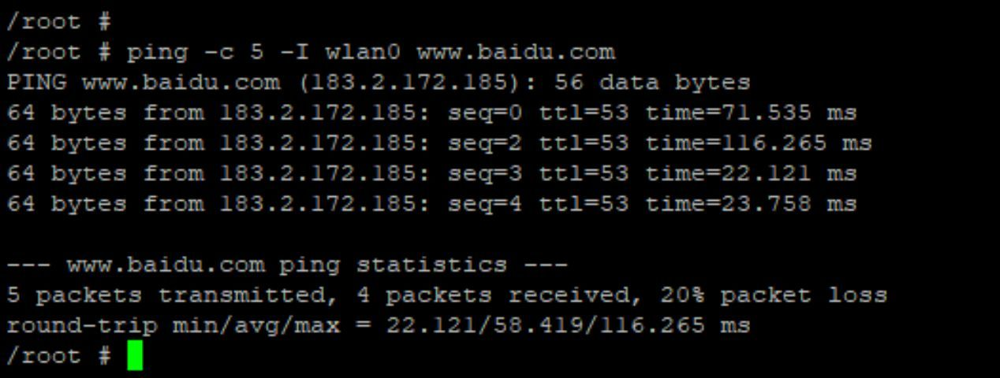
