# Application Development Demo

## Usage of FRTDemo

1. Use Type-C to connect Aixinpai Zero to the computer. There are two ways to enter the terminal.

a. Enter directly through the serial port

b. Via <a href="https://axera-pi-zero-docs-cn.readthedocs.io/zh-cn/latest/doc_guide_faq.html"> Modify the IP</a> and use a network cable to connect the device to the computer

2. Open putty, enter the serial port/IP corresponding to the device, and click Open 

3. After entering, enter the user password and enter the terminal (the password will not be displayed) 
Username: root 
Password: 123456 
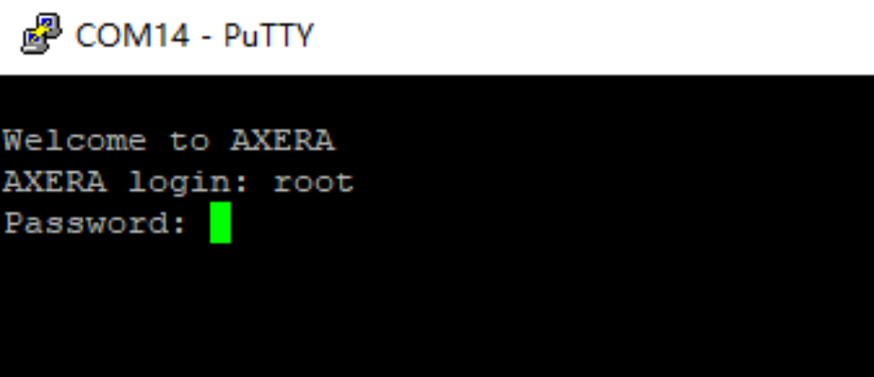

4. Enter the command to enter FRTDemo 
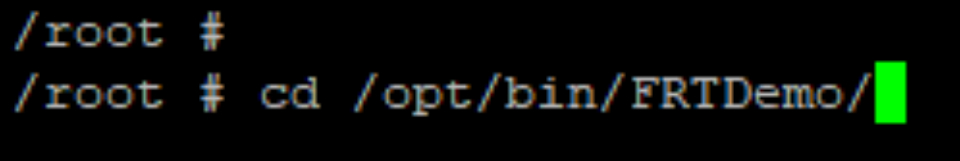

5. Enter the command to start Demo 
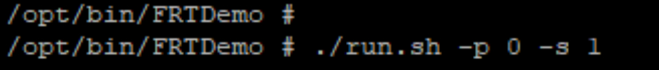

6. Open the web page and enter the URL in the running content into the URL box
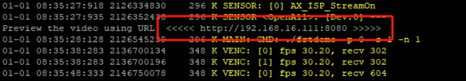

7. Log in to the webpage corresponding to the Demo to preview immediately.
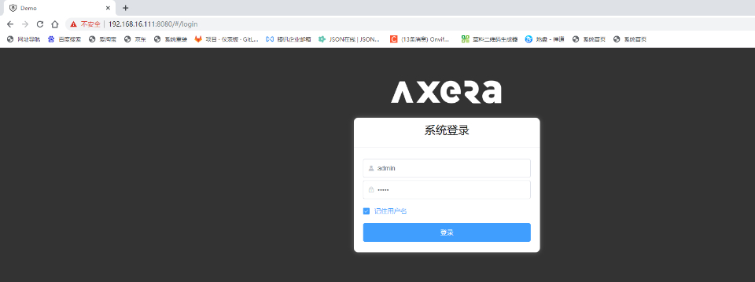

If you need the FRTDemo source code, please click <a href="https://github.com/AXERA-TECH/ax620q_bsp_sdk">here</a> to view 
 
 

## NFS mount

1. Click <a href="https://pan.baidu.com/s/1ZhK5TAt4H6BPRn4bDA1oXA">this link</a> to download the nfs server tool 
Extraction code: Zero 

2. Replace the exports file in the installation package with the path where nfs is located.
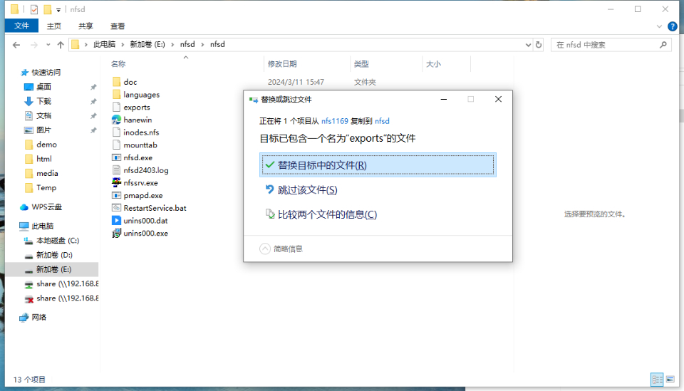

4. Open the nfs server on the desktop, click Output, click Edit output table file, fill in the file corresponding to the IP address of the device and the directory to be shared, and click Restart the server 
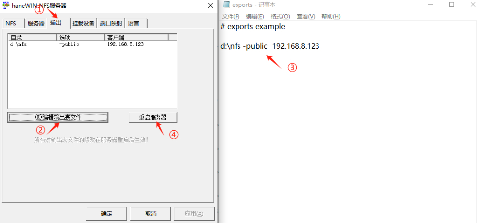

5. Create a directory corresponding to the shared directory in the edit output table file 
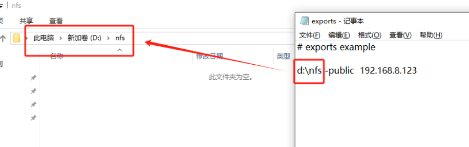

6. Open "Computer Management", click Services, find NFS Server, right-click and select Restart 
(If it is stopped after restarting, it can be restored by restarting the computer) 
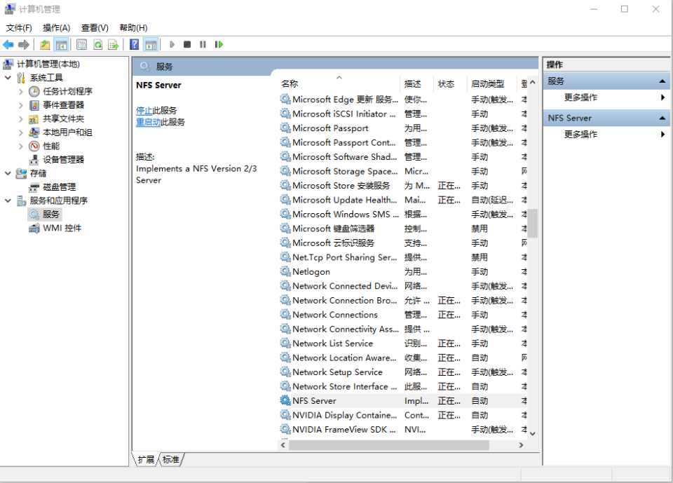

7. After the restart is complete, open the nfs server and click Output. If this configuration appears, it means that the nfs service has been started 
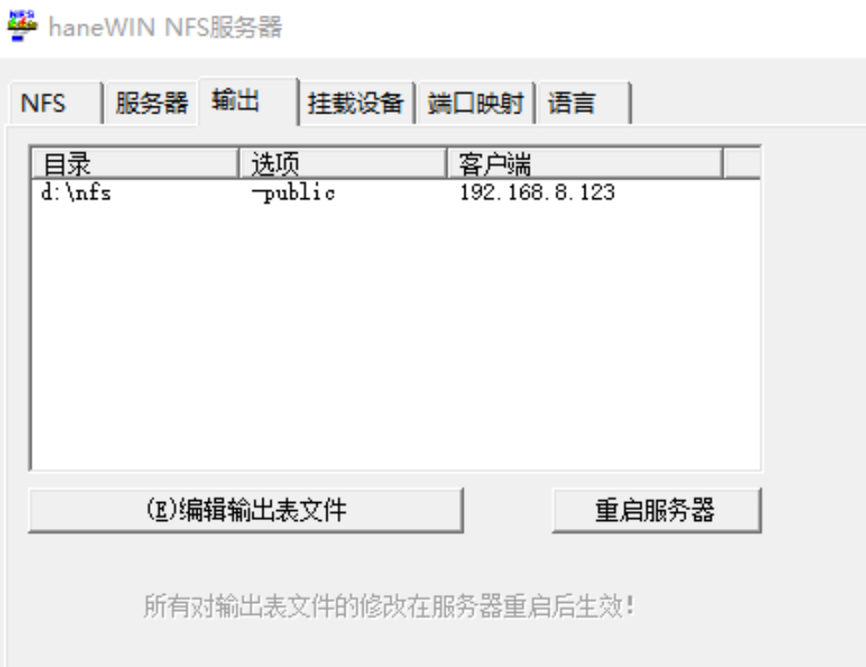

8. Connect the device to the computer through a network cable, open the network configuration, click Change Adapter, find the Ethernet corresponding to the device, right-click Properties, and modify IPv4 
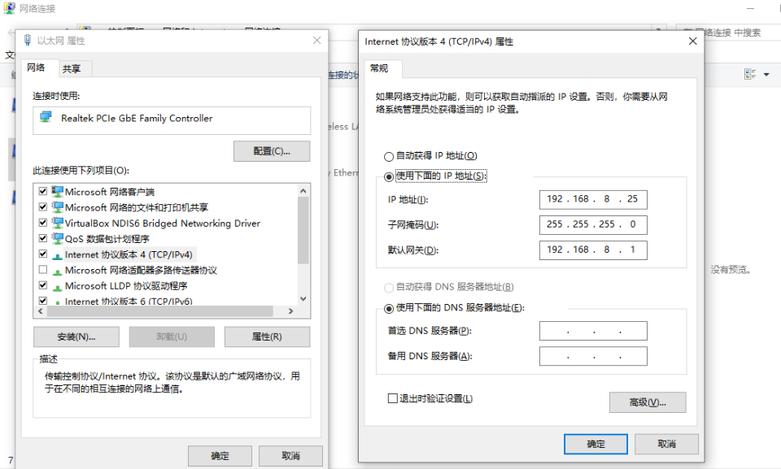

9. Windows and the device ping each other. If the ping can succeed, the network configuration is successful. (If ping from the device fails, you can turn off the firewall) 
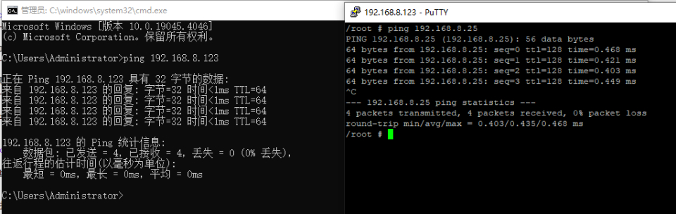

10. Enter the command to mount nfs 
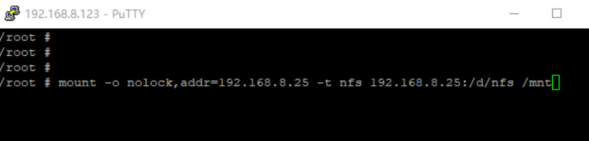

11. You can create a file in the mounting directory to verify whether the mounting is successful.
