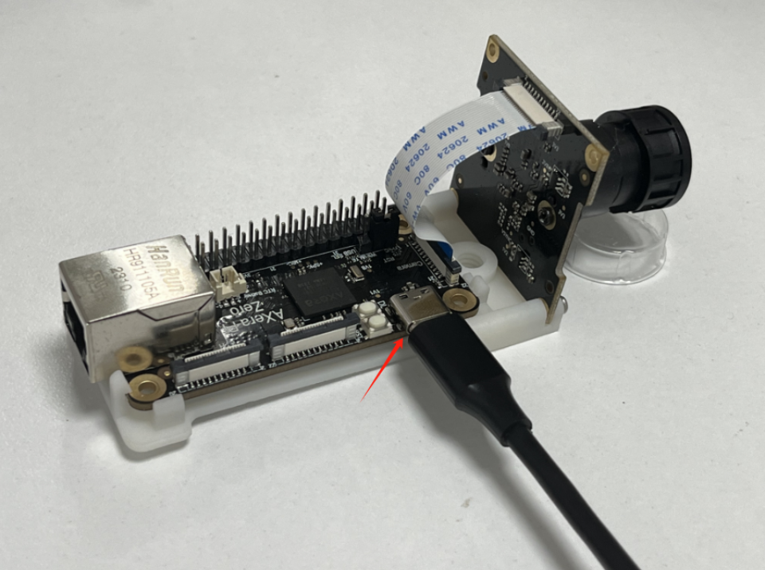
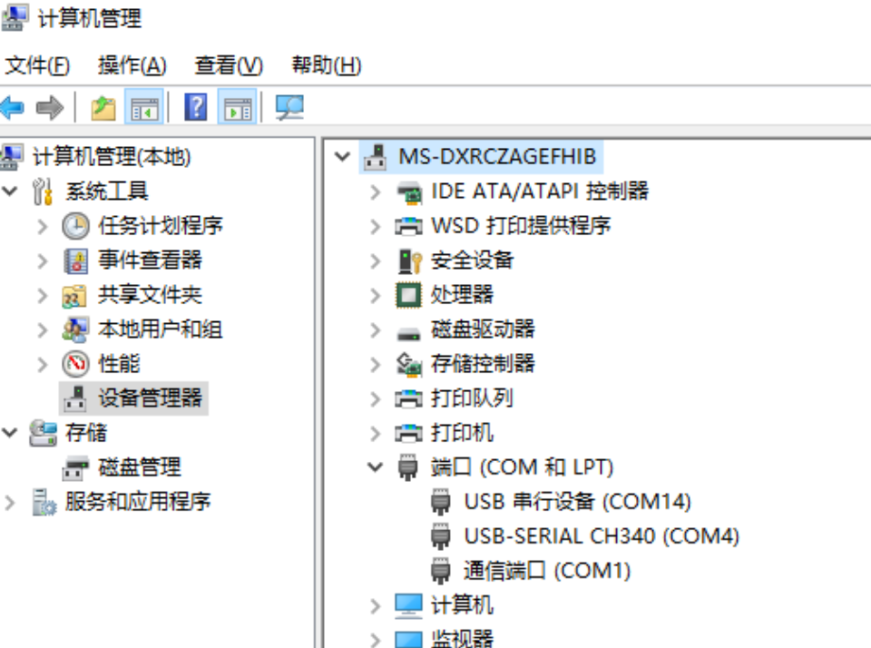
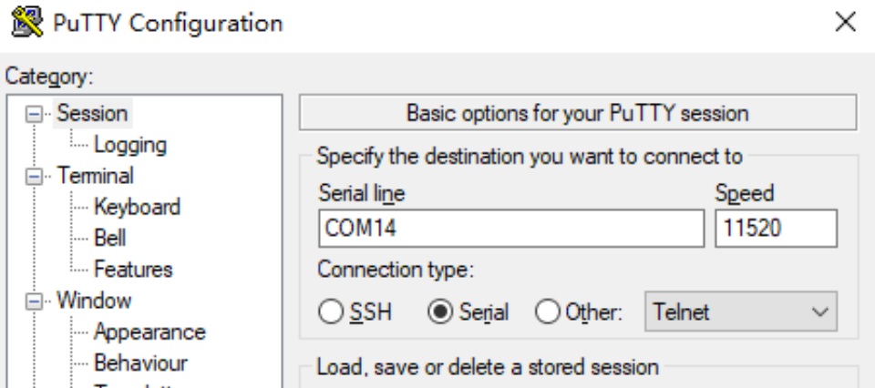
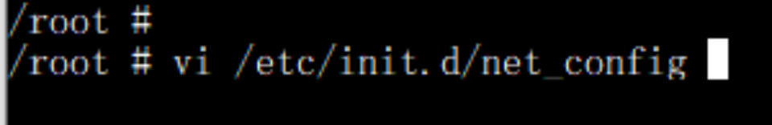
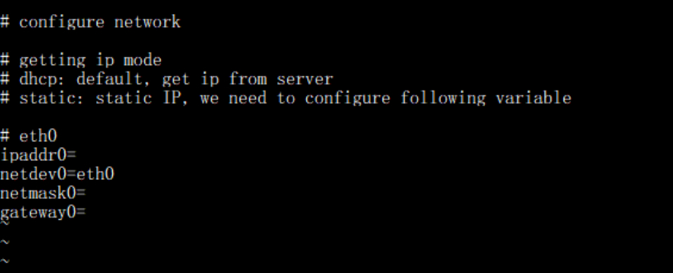
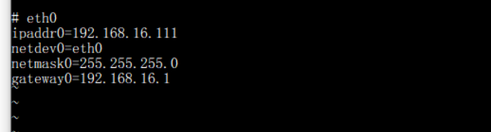

# FAQ

## IP modification

1. Connect Aixinpai Zero to the computer through Type-C cable 
	

2. Check "Computer Management" to confirm the serial port corresponding to the device
	

3. Open putty, enter the serial port corresponding to the device, and click Open 
	

4. After entering, enter the user password and enter the terminal (the password will not be displayed) 
Username: root 
Password: 123456 
	

5. Modify the IP after entering the command 
	

6. Modify the required IP and save 
	 

	 

7. After the modification is completed, it will take effect immediately after restarting 

<b>(PS: IP can also be assigned automatically through DHCP)</b>

Click <a href="https://pan.baidu.com/s/1ZhK5TAt4H6BPRn4bDA1oXA">here</a> to download putty 
Extraction code: Zero

## Community information

If you have other questions, you can ask in the group.  
QQ:139953715